<div align="center">

# CatalogFlow

**Catálogo PDF de moda → instrumento de pedido → romaneio estruturado → ERP**

_SaaS B2B que transforma catálogos PDF visuais em campos de pedido interativos,_
_extrai pedidos preenchidos em romaneios e fecha o ciclo integrando o ERP da marca._

[](https://catalogo.thiagoscutari.com.br)
[](#roadmap-e-sprints)
[](#stack-técnica)
[](#desenvolvimento)
[](#licença-e-contribuição)

🌐 **Produção:** <https://catalogo.thiagoscutari.com.br> · 📦 **Repositório:** <https://github.com/ThiagoScutari/chatbot_pdf_oasis>

</div>

---

> **Codename:** PDF Oasis · **Cliente piloto:** Oasis Resortwear (moda feminina premium, Goiânia/GO) · **Consultoria:** Thiago Scutari
>
> A fonte de verdade técnica é [`spec.md`](./spec.md). O guia do executor de código é [`CLAUDE.md`](./CLAUDE.md). O escopo de cada sprint está em [`docs/sprint_XX/PRD_sprint_XX.md`](./docs).

---

## Índice

- [CatalogFlow](#catalogflow)
  - [Índice](#índice)
  - [O problema](#o-problema)
  - [A solução](#a-solução)
  - [Tour visual da aplicação](#tour-visual-da-aplicação)
    - [1. Login](#1-login)
    - [2. Dashboard](#2-dashboard)
    - [3. Catálogos](#3-catálogos)
    - [4. Processar um novo catálogo](#4-processar-um-novo-catálogo)
    - [5. Detalhe do catálogo e produtos detectados](#5-detalhe-do-catálogo-e-produtos-detectados)
    - [6. Receber um pedido](#6-receber-um-pedido)
    - [7. Pedido extraído](#7-pedido-extraído)
    - [8. Pedidos recebidos](#8-pedidos-recebidos)
    - [9. Integração com o ERP](#9-integração-com-o-erp)
  - [Demonstração](#demonstração)
  - [Arquitetura](#arquitetura)
    - [Os dois pipelines de processamento](#os-dois-pipelines-de-processamento)
    - [Modelo de dados](#modelo-de-dados)
    - [O motor de PDF é feito de funções puras](#o-motor-de-pdf-é-feito-de-funções-puras)
    - [Convenção de nomes dos campos AcroForm](#convenção-de-nomes-dos-campos-acroform)
  - [Setup local em 5 minutos](#setup-local-em-5-minutos)
  - [Acesso via navegador](#acesso-via-navegador)
  - [Fluxo completo via API](#fluxo-completo-via-api)
  - [Integração ERP (Sprint 04)](#integração-erp-sprint-04)
    - [Configuração](#configuração)
    - [Modo `mock` (default)](#modo-mock-default)
    - [Modo `consistem`](#modo-consistem)
    - [Fluxo ERP via API](#fluxo-erp-via-api)
    - [Pelo navegador](#pelo-navegador)
  - [Endpoints](#endpoints)
  - [Stack técnica](#stack-técnica)
    - [Serviços do stack local](#serviços-do-stack-local)
  - [Estrutura do projeto](#estrutura-do-projeto)
  - [Desenvolvimento](#desenvolvimento)
    - [Migrations](#migrations)
    - [Regenerar fixtures de teste](#regenerar-fixtures-de-teste)
  - [CI/CD](#cicd)
  - [Roadmap e sprints](#roadmap-e-sprints)
  - [Troubleshooting](#troubleshooting)
  - [Licença e contribuição](#licença-e-contribuição)

---

## O problema

Empresas de moda brasileiras distribuem catálogos de coleção em **PDF visual** — bonito,
produzido por agência de marketing, mas sem campos editáveis. O fluxo de pedido atual é
inteiramente manual:

1. A gerente comercial envia o PDF para as lojistas por WhatsApp.
2. A lojista imprime o catálogo e escreve as quantidades à mão por produto/cor/tamanho.
3. Fotografa a página preenchida e devolve a imagem por WhatsApp.
4. A gerente **interpreta a foto manualmente**, consulta o estoque e digita o pedido no ERP.

**Custo mensurável desse processo:**

- 2–4 horas/dia de trabalho manual repetitivo da gerente comercial.
- Taxa de erro de transcrição estimada em **8–15%** (tamanho ou quantidade errados).
- Ciclo de pedido de 1–3 dias — enquanto a concorrência digital fecha em horas.
- Zero dados estruturados: nenhum analytics sobre o que cada lojista mais pede.

O catálogo PDF não é o problema — ele continua sendo o instrumento de comunicação de moda.
O que falta é um **mecanismo de captura estruturada de dados**.

## A solução

O **CatalogFlow** não substitui o catálogo: torna-o interativo, em quatro etapas
automatizadas via API ou pela interface web.

<p align="center">
  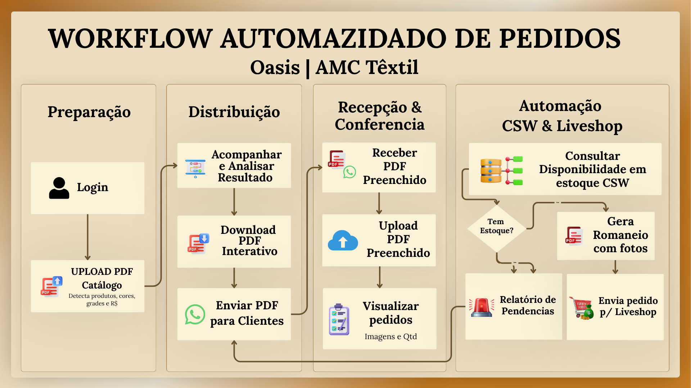
</p>

**Proposta de valor:**

- De 2–4 h/dia para **menos de 10 minutos** de revisão estruturada.
- Erro de transcrição → **0%** — os dados são digitados pela própria lojista.
- Ciclo de pedido reduzido de dias para horas.
- Pedidos viram dados estruturados — base para histórico, analytics e forecasting.

---

## Tour visual da aplicação

A interface web é **mobile-first**, servida pelo próprio FastAPI (Jinja2 + HTMX +
Alpine.js, sem build step), com a identidade visual da Oasis Resortwear.

### 1. Login

Acesso por e-mail e senha (com magic link via Resend como alternativa). A sessão dura
8 horas em um cookie `cf_session` assinado com HMAC e marcado como `httponly`.

<p align="center">
  
</p>

### 2. Dashboard

Visão geral da marca: catálogos ativos, catálogos prontos para baixar, pedidos
recebidos, romaneios gerados e a atividade recente.

<p align="center">
  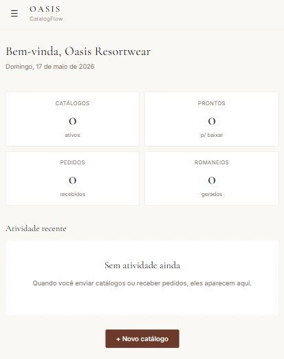
</p>

### 3. Catálogos

Lista de catálogos processados, com coleção, número de SKUs detectados, status do
processamento e data de criação.

<p align="center">
  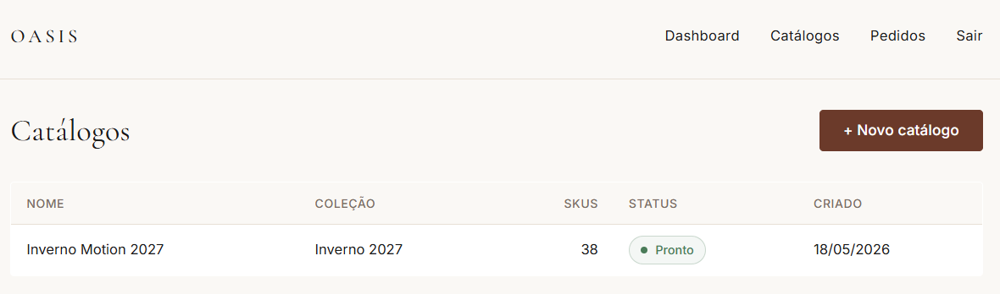
</p>

### 4. Processar um novo catálogo

Upload do PDF visual da agência (até 50 MB). O nome do catálogo é obrigatório; a
coleção é opcional. O processamento é assíncrono — a interface retorna na hora e
acompanha o `job` em background.

<p align="center">
  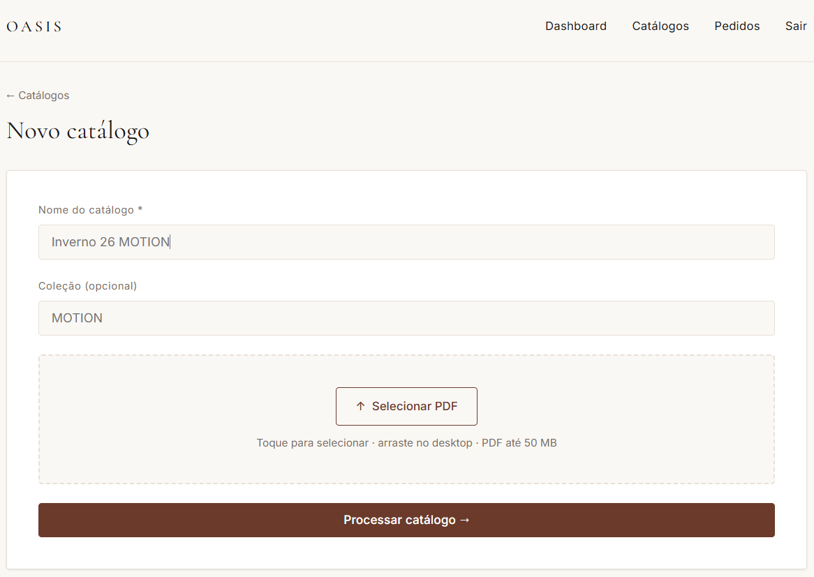
</p>

### 5. Detalhe do catálogo e produtos detectados

Quando o processamento termina, o catálogo fica **Pronto**. O `PDFAnalyzer` extrai
automaticamente cada produto — SKU, nome, preço, grade de tamanhos e número de cores —
e o `FieldInjector` injeta os campos AcroForm. O PDF editável fica disponível para
download.

<p align="center">
  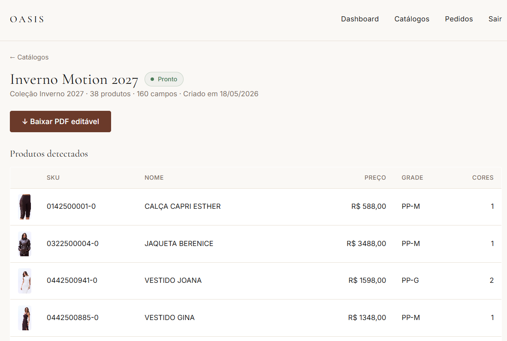
</p>

As miniaturas dos produtos são obtidas via scraping do QRCode da AMC — o mesmo
mecanismo usado nos PDFs de romaneio. Clicar na miniatura abre a foto em tamanho real.

<p align="center">
  
</p>

### 6. Receber um pedido

A gerente faz upload do PDF preenchido pela lojista, escolhe o catálogo de origem
(para enriquecer os itens com nome, preço e cor) e identifica a lojista.

<p align="center">
  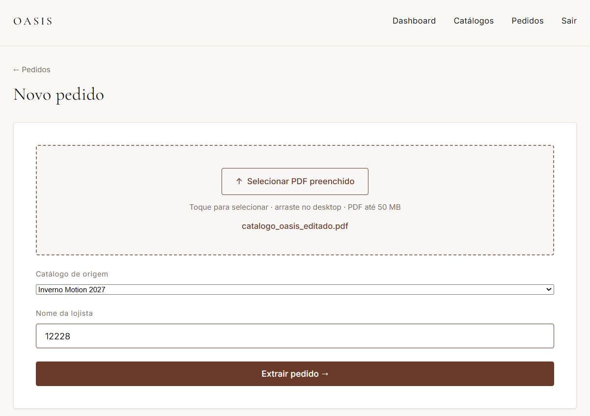
</p>

O upload mostra progresso em tempo real e dispara a extração assíncrona.

<p align="center">
  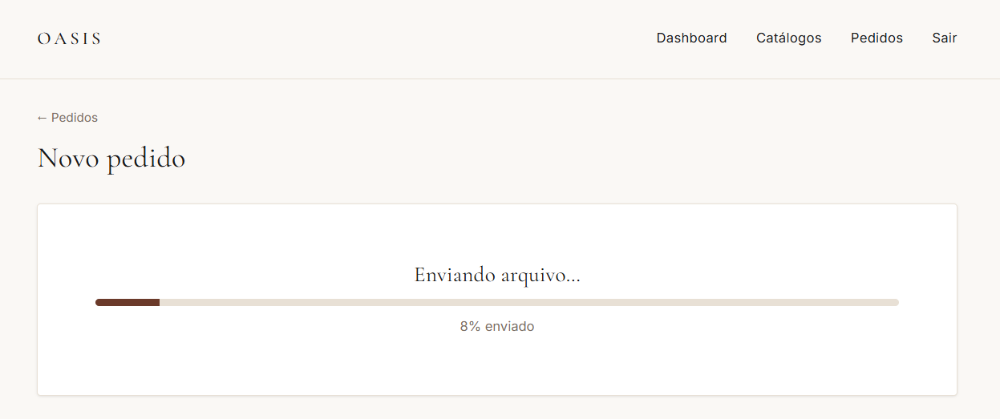
</p>

### 7. Pedido extraído

Concluída a extração, o sistema mostra o resumo — total de SKUs e de peças — com
atalhos para ver o pedido detalhado ou baixar o romaneio PDF.

<p align="center">
  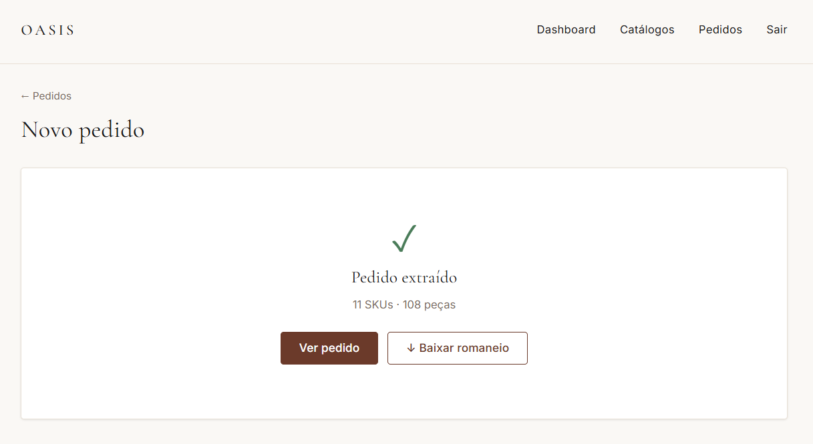
</p>

### 8. Pedidos recebidos

Todos os pedidos da marca em um só lugar: lojista, catálogo de origem, total de peças,
status e data.

<p align="center">
  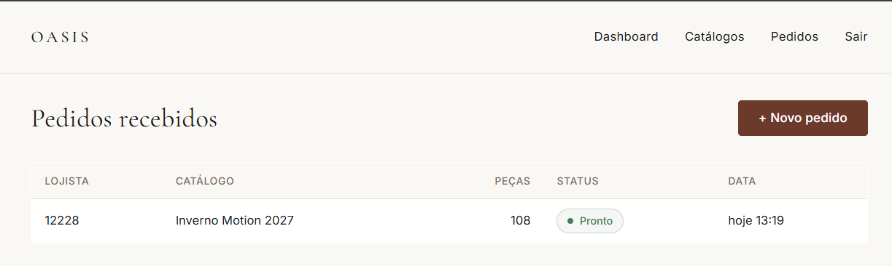
</p>

### 9. Integração com o ERP

No detalhe do pedido, a gerente consulta a disponibilidade de estoque item a item no
ERP da marca, gera um relatório de pendências (PDF com os itens não atendidos
integralmente) e envia o pedido ao ERP informando o código do cliente.

<p align="center">
  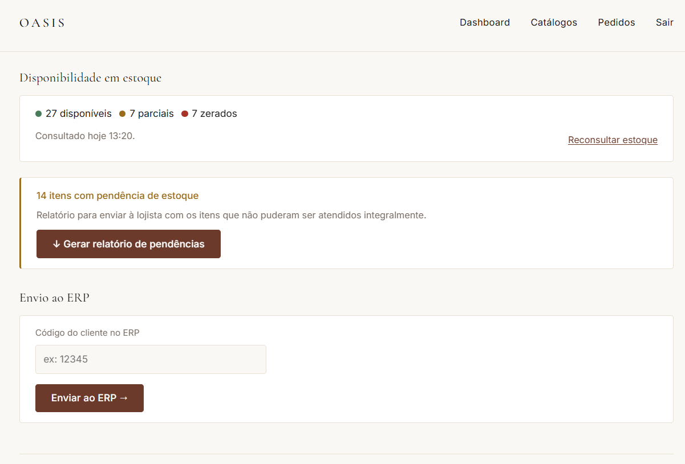
</p>

---

## Demonstração

Fluxo completo de **consulta de estoque e geração de relatório de pendências** dentro
da interface web:

<p align="center">
  
</p>


---

## Arquitetura

CatalogFlow é um **monolito modular** em Python. Cada domínio é um módulo isolado, com
seus próprios modelos, schemas, serviço, rotas e testes. Os módulos conversam por
imports diretos — nunca por HTTP interno.

<p align="center">
  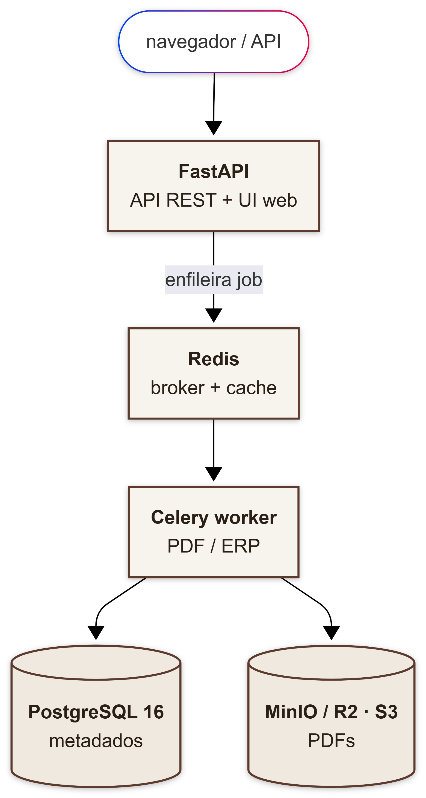
</p>

**Decisões arquiteturais** (detalhadas como ADRs em [`spec.md §3`](./spec.md)):

- **ADR-001 — Monolito modular.** Sem microserviços. Deploy de um único container;
  refatoração segura apoiada em type hints e testes.
- **ADR-002 — FastAPI + Celery.** O processamento de PDF é CPU-bound (2–15 s). Os
  endpoints retornam `job_id` na hora; o cliente faz polling. **Nunca** processa PDF
  de forma síncrona no handler HTTP.
- **ADR-003 — PostgreSQL + Redis sempre.** Sem SQLite, nem em dev nem em testes —
  paridade total com produção e suporte a escrita concorrente de múltiplos workers.
- **ADR-004 — PyMuPDF (AGPL).** O repositório é público no GitHub, o que cumpre a
  exigência de divulgação de código da AGPL. Sem necessidade de licença comercial
  enquanto o repositório permanecer público.
- **ADR-005 — Storage S3-compatível.** Todos os PDFs ficam em object storage (MinIO
  em dev/prod, Cloudflare R2 planejado para escala). O banco guarda só metadados e a
  chave do objeto.
- **ADR-006 — Versionamento de API.** Toda rota pública sob `/api/v1/`.
- **ADR-007 — Zonas de Voronoi horizontal.** O `PDFAnalyzer` calcula dinamicamente
  as zonas de busca de texto por SKU (fronteiras nos pontos médios entre SKUs), o que
  funciona para 1, 2, 3 ou N produtos por página. Nenhuma posição é hardcoded.
- **ADR-008 / ADR-009 — Mypy cirúrgico + pre-commit obrigatório.** `mypy` cobre 100%
  do código próprio; supressões pontuais só nas chamadas a `pymupdf`. `pre-commit` é
  portão local obrigatório — o CI passa de primeira.

### Os dois pipelines de processamento

**1. Processamento de catálogo** — `POST /api/v1/catalogs/process`

```
upload PDF → valida (MIME server-side, ≤50 MB, não criptografado) → storage
  → cria Catalog (status=pending) → job Celery
  → PDFAnalyzer.analyze()  → persiste CatalogProducts
  → FieldInjector.inject() → PDF editável → storage
  → Catalog (status=ready) → Job (status=success)
```

**2. Extração de pedido** — `POST /api/v1/orders/extract`

```
upload PDF preenchido → valida → storage → cria Order (status=draft) → job Celery
  → lê widgets AcroForm → parseia field names (v1 + v2) → normaliza
  → persiste OrderItems → gera Romaneio PDF → storage
  → Order (status=extracted)
```

### Modelo de dados

O schema multi-tenant: toda entidade pendura em `brands`, e `jobs` rastreia o
processamento assíncrono de catálogos, pedidos e romaneios.

<p align="center">
  
</p>

### O motor de PDF é feito de funções puras

A regra arquitetural mais importante para testabilidade: `pdf_analyzer.py` e
`field_injector.py` são **funções puras** — recebem `bytes`, devolvem `bytes` ou
dataclasses. Nunca abrem arquivos, nunca escrevem em disco, nunca tocam storage ou
banco. Todo o I/O fica no `service.py`.

```python
# CORRETO — puro, testável, sem I/O
class PDFAnalyzer:
    def analyze(self, pdf_bytes: bytes) -> CatalogMetadata: ...

class FieldInjector:
    def inject(self, pdf_bytes: bytes, metadata: CatalogMetadata) -> bytes: ...
```


### Convenção de nomes dos campos AcroForm

Os campos injetados no PDF seguem **exatamente** este padrão:

```
qty__<SKU>__cor<N>__<TAM>

qty__0442500912-0__cor1__PP    # SKU 0442500912-0, cor 1, tamanho PP
qty__0442500912-0__cor2__M     # mesmo SKU, cor 2, tamanho M
qty__0442500912-0__PP          # formato legado v1 — sem índice de cor (= cor1)
```

Essa convenção **nunca muda** — PDFs preenchidos já circulam com ela.

---

## Setup local em 5 minutos

**Pré-requisitos:** Docker Desktop, Python 3.12+ e git.

```bash
git clone https://github.com/ThiagoScutari/chatbot_pdf_oasis.git
cd chatbot_pdf_oasis
cp .env.example .env

# 1) Sobe o stack completo (API + worker + beat + Postgres + Redis + MinIO + Flower)
docker compose -f docker/docker-compose.yml up -d

# 2) Aplica as migrations
docker compose -f docker/docker-compose.yml exec api alembic upgrade head

# 3) Cria a brand `oasis` + uma API key de dev (a key aparece UMA única vez)
docker compose -f docker/docker-compose.yml exec api \
  python -m catalogflow.scripts.seed_dev
# Copie a linha:  export CATALOGFLOW_API_KEY="cf_..."

# 4) Smoke check
curl http://localhost:8004/api/v1/health
```

O `seed_dev` imprime a API key apenas uma vez — guarde-a. A documentação OpenAPI fica
em <http://localhost:8004/api/v1/docs> (somente quando `ENVIRONMENT != production`).

---

## Acesso via navegador

A gerente comercial opera o ciclo inteiro sem terminal:

1. Abra <http://localhost:8004/login> no celular ou no desktop.
2. Cole a `CATALOGFLOW_API_KEY` gerada pelo `seed_dev`.
3. Use o menu: **Dashboard · Catálogos · Pedidos · Sair**.
4. A sessão dura 8 horas (cookie `cf_session` assinado com HMAC, `httponly`).

A UI é Jinja2 + HTMX + Alpine.js servida pelo próprio FastAPI — sem build step, sem
porta extra. O cookie carrega a API key assinada; cada ação da web faz chamadas
internas autenticadas à API REST.

---

## Fluxo completo via API

Ciclo ponta a ponta: catálogo → PDF editável → preenchimento → extração → romaneio.
Cada etapa é assíncrona e retorna um `job_id` para polling. `Bearer cf_*` em todos os
endpoints.

```bash
export API="http://localhost:8004/api/v1"
export KEY="cf_xxxxx"

# ── 1) Submete o catálogo PDF visual
curl -X POST "$API/catalogs/process" \
  -H "Authorization: Bearer $KEY" \
  -F "file=@catalogo.pdf" \
  -F "name=Inverno 26 MOTION" \
  -F "collection=MOTION"
# → 202 { data: { catalog_id, job_id, poll_url: "/api/v1/jobs/..." } }

# ── 2) Polling do job de processamento (até status="success")
curl -H "Authorization: Bearer $KEY" "$API/jobs/$JOB_ID"

# ── 3) Download do PDF editável (já com os campos AcroForm injetados)
curl -L -H "Authorization: Bearer $KEY" -o editavel.pdf \
  "$API/catalogs/$CATALOG_ID/download"
# → A lojista preenche os campos no Adobe Reader / Foxit / Xodo

# ── 4) A gerente faz upload do PDF devolvido pela lojista
curl -X POST "$API/orders/extract" \
  -H "Authorization: Bearer $KEY" \
  -F "file=@preenchido.pdf" \
  -F "catalog_id=$CATALOG_ID" \
  -F "lojista_name=Loja Moda e Arte"
# → 202 { data: { order_id, job_id, poll_url } }
# Sem catalog_id também funciona — mas os itens não serão enriquecidos.

# ── 5) Polling até a extração completar
curl -H "Authorization: Bearer $KEY" "$API/jobs/$ORDER_JOB_ID"

# ── 6) Pedido estruturado (itens, totais, lojista)
curl -H "Authorization: Bearer $KEY" "$API/orders/$ORDER_ID"

# ── 7) Romaneio PDF
#   - Se ainda não gerado: 202 com job_id (a geração começa em background)
#   - Quando pronto: 302 redirect para a presigned URL
curl -L -H "Authorization: Bearer $KEY" -o romaneio.pdf \
  "$API/orders/$ORDER_ID/romaneio"
```

**Erros relevantes:**

- `INVALID_FILE_TYPE` (400) — o arquivo enviado não é um PDF.
- `FILE_TOO_LARGE` (400) — ultrapassou `MAX_PDF_SIZE_MB`.
- `PDF_FLATTENED` (422) — o PDF veio sem `/AcroForm` (foi impresso como PDF em vez de
  "Salvar como PDF"). Erro **permanente** — o Celery não tenta de novo.
- `CATALOG_NOT_FOUND` / `ORDER_NOT_FOUND` (404) — o recurso não pertence à brand
  autenticada. A resposta não vaza a existência do recurso.

---

## Integração ERP (Sprint 04)

O CatalogFlow conversa com o ERP da marca em dois fluxos — **consulta de estoque** e
**envio do pedido** — usando o **Adapter Pattern**. `StockAdapter` é a interface única,
implementada por dois adapters intercambiáveis em runtime.

### Configuração

```bash
ERP_ADAPTER=mock              # "mock" | "consistem"
ERP_BASE_URL=https://api.consistem.com.br
ERP_API_KEY=                  # token de autenticação do Consistem
ERP_EMPRESA=50                # código da AMC Têxtil
ERP_COD_NATUREZA=505          # natureza de estoque nacional AMC
ERP_TIMEOUT=30                # timeout do client (request individual = 3s)
```

Trocar de adapter é **uma única variável de ambiente** — basta reiniciar os containers
`api` e `worker`, que releem as settings. Sem rebuild da imagem.

### Modo `mock` (default)

- Respostas **determinísticas** via hash MD5 de `(sku, size, color)`: ~70% disponível,
  ~20% parcial, ~10% sem estoque.
- `submit_order` sempre aceita e devolve uma referência `MOCK-<8 hex>`.
- Sem dependência de rede — ideal para demo comercial, dev local e CI sem flakiness.

### Modo `consistem`

- `check_availability` consulta
  `GET {erp_base_url}/saldoEstoqueAtual/{codItem}/{erp_cod_natureza}` com header
  `empresa={erp_empresa}`, paralelismo limitado a 5 requests, timeout de 3 s por item.
- Fórmula contábil:
  `disponivel = estoqueAtual − estReservPedido − estReservProducao − estReservLotes`.
- O mapeamento `(sku, size, color_index) → codItem` está isolado em `_build_cod_item()`
  — formato provisório `"{sku}.{size}.{color_index}"`. Quando a Oasis fornecer o
  de-para real, só essa função muda.
- `submit_order` ainda levanta `NotImplementedError` enquanto a Oasis não define o
  endpoint de criação de pedido no Consistem.

### Fluxo ERP via API

```bash
# Dispara a consulta de estoque do pedido (assíncrona)
curl -X POST -H "Authorization: Bearer $KEY" \
  "$API/orders/$ORDER_ID/stock-check"
# → 202 { data: { stock_check_id, job_id, status: "pending" } }

# Resultado quando o job estiver "success"
curl -H "Authorization: Bearer $KEY" "$API/orders/$ORDER_ID/stock-check"
# → 200 { data: { status: "completed", summary: {...}, items: [...] } }

# Envia o pedido ao ERP
curl -X POST -H "Authorization: Bearer $KEY" \
  -H "Content-Type: application/json" \
  -d '{"customer_code": "12345"}' \
  "$API/orders/$ORDER_ID/submit"
# → 202 { data: { submission_id, job_id, status: "pending" } }

# Status do envio
curl -H "Authorization: Bearer $KEY" "$API/orders/$ORDER_ID/submission"
# → 200 { data: { status: "accepted", erp_reference: "MOCK-a7f3e91b" } }
```

### Pelo navegador

O detalhe do pedido ganha os blocos **"Disponibilidade em estoque"** e **"Envio ao
ERP"**. Quando há itens com pendência, aparece um terceiro bloco com o botão
**"↓ Gerar relatório de pendências"** — um PDF gerado on-the-fly com os itens não
atendidos e a quantidade disponível por tamanho. A tabela de itens passa a mostrar uma
sub-linha "Disponível" com as quantidades por tamanho coloridas (verde = atende, âmbar
= parcial, vermelho = zerado). O botão **"Regenerar romaneio"** reprocessa o PDF com os
dados atuais sem mexer no banco.

**Erros relevantes:** `ORDER_NOT_FOUND` (404), `ORDER_ALREADY_SUBMITTED` (409 — pedido
em estado terminal), `STOCK_CHECK_NOT_FOUND` (404), `SUBMISSION_NOT_FOUND` (404).

---

## Endpoints

| Método | Caminho | Auth | Descrição |
|---|---|---|---|
| `GET` | `/api/v1/health` | público | Status + contagem de jobs pendentes por tipo |
| `POST` | `/api/v1/catalogs/process` | `Bearer cf_*` | Submete catálogo PDF (multipart) |
| `GET` | `/api/v1/catalogs/{id}` | `Bearer cf_*` | Metadados + produtos detectados |
| `GET` | `/api/v1/catalogs/{id}/download` | `Bearer cf_*` | 302 → presigned URL do PDF editável |
| `POST` | `/api/v1/orders/extract` | `Bearer cf_*` | Submete PDF preenchido para extração |
| `GET` | `/api/v1/orders/{id}` | `Bearer cf_*` | Pedido completo (itens + totais) |
| `GET` | `/api/v1/orders/{id}/romaneio` | `Bearer cf_*` | 302 → romaneio quando pronto; 202 + job_id em andamento |
| `POST` | `/api/v1/orders/{id}/stock-check` | `Bearer cf_*` | Dispara consulta de estoque no ERP |
| `GET` | `/api/v1/orders/{id}/stock-check` | `Bearer cf_*` | Resultado da última consulta (summary + items) |
| `POST` | `/api/v1/orders/{id}/submit` | `Bearer cf_*` | Envia o pedido ao ERP (body `{customer_code}`) |
| `GET` | `/api/v1/orders/{id}/submission` | `Bearer cf_*` | Status do envio (status + erp_reference) |
| `GET` | `/api/v1/jobs/{id}` | `Bearer cf_*` | Polling — `catalog.process`, `order.extract`, `romaneio.generate`, `stock.check`, `stock.submit` |
| `POST` | `/internal/brands` | `X-Internal-Secret` | Cria nova brand (admin) |
| `POST` | `/internal/brands/{id}/api-keys` | `X-Internal-Secret` | Cria API key (raw retornado uma única vez) |

Toda resposta segue o envelope padrão:

```json
{
  "success": true,
  "data": { },
  "error": null,
  "meta": { "request_id": "uuid", "timestamp": "ISO-8601" }
}
```

---

## Stack técnica

| Camada | Tecnologia |
|---|---|
| Runtime | Python 3.12+ |
| Web / API | FastAPI 0.115+ · Pydantic v2 |
| UI web | Jinja2 + HTMX + Alpine.js (sem build step) |
| ORM / Migrations | SQLAlchemy 2.0 async · Alembic |
| Fila assíncrona | Celery 5.x |
| Banco / Broker | PostgreSQL 16 · Redis 7 |
| Motor de PDF | PyMuPDF (fitz) 1.27+ · pdfplumber · qrcode |
| Storage | MinIO (dev/prod) · Cloudflare R2 (planejado) |
| Auth | API keys SHA-256 (`cf_`) · sessão web por cookie HMAC · magic link (Resend) |
| HTTP client (ERP) | httpx async |
| Testes | pytest · pytest-asyncio · testcontainers · factory-boy · pytest-cov |
| Qualidade | ruff (lint + format) · mypy strict · pip-audit · bandit · pre-commit |
| Container / Deploy | Docker multi-stage non-root · VPS + Docker Compose + Traefik |
| CI | GitHub Actions |

### Serviços do stack local

| Serviço | Porta | Notas |
|---|---|---|
| API (FastAPI) | 8004 | `uvicorn` com hot-reload em dev; serve API REST **e** UI web |
| Celery worker | — | Concurrency 2; queues `catalog`, `orders`, `romaneio`, `stock` |
| Celery beat | — | Scheduler (sem jobs periódicos por ora) |
| Flower | 5555 | Monitoring do Celery (dev only) |
| PostgreSQL | 5432 | `catalogflow:catalogflow@postgres:5432/catalogflow` |
| Redis | 6379 | broker (db 1), backend (db 2), cache (db 0) |
| MinIO | 9000 / 9001 | Substitui R2/S3 em dev. Console: <http://localhost:9001> |

---

## Estrutura do projeto

```
src/catalogflow/
├── main.py                  # create_app() — FastAPI app factory
├── modules/
│   ├── auth/                # Brand + ApiKey + WebUser, multi-tenant
│   ├── catalog/             # Pipeline de processamento de catálogo PDF
│   │   ├── pdf_analyzer.py  #   PURO: bytes → CatalogMetadata (sem I/O)
│   │   ├── field_injector.py#   PURO: bytes + metadata → bytes (sem I/O)
│   │   ├── service.py       #   Orquestra analyzer + injector + storage
│   │   ├── tasks.py         #   Tasks Celery
│   │   ├── router.py        #   Endpoints REST
│   │   └── tests/
│   ├── orders/              # Extração de pedidos + normalização + persistência
│   ├── romaneio/            # Geração do romaneio PDF (com fotos dos produtos)
│   ├── stock/               # Integração ERP — Adapter Pattern
│   │   └── adapters/        #   base.py (ABC) · mock · consistem
│   └── reservation/         # Esqueleto — Fase 3
├── shared/
│   ├── errors.py            # DomainError + subclasses
│   ├── responses.py         # StandardResponse[T] — envelope padrão
│   ├── middleware.py        # RequestIdMiddleware
│   ├── jobs_router.py       # GET /api/v1/jobs/{id}
│   └── image_fetcher.py     # Scraping do AMC QRCode (UI + PDFs)
├── infra/
│   ├── settings.py          # Pydantic BaseSettings (config via env vars)
│   ├── database.py          # SQLAlchemy 2.0 async — engine, session, Base
│   ├── cache.py             # Pool Redis async
│   ├── storage.py           # Wrapper S3/R2 (aioboto3)
│   └── celery_app.py        # Factory do Celery + routing de tasks
└── scripts/
    └── seed_dev.py          # Cria a brand `oasis` + uma API key de dev
```

Os testes vivem **dentro de cada módulo** (`modules/<x>/tests/`); apenas os testes de
integração e E2E ficam na raiz `tests/`.

---

## Desenvolvimento

```bash
# Setup do venv local (opcional — os testes também rodam via Docker)
python -m venv .venv
source .venv/bin/activate          # Linux/Mac
# .venv\Scripts\activate           # Windows
pip install -e ".[dev]"

# OBRIGATÓRIO após clonar: instala os hooks de ruff + mypy
pre-commit install
pre-commit run --all-files         # verificação manual de tudo

# Lint + format + type check
ruff check .
ruff format .
mypy src/

# Testes (precisa do Docker rodando — testcontainers sobe um Postgres efêmero)
pytest tests/ src/catalogflow/modules --cov=src/catalogflow --cov-fail-under=80

# Só o módulo catalog
pytest src/catalogflow/modules/catalog/tests/ -v

# Iteração rápida nas funções puras (não precisam de DB)
pytest src/catalogflow/modules/catalog/tests/test_pdf_analyzer.py \
       src/catalogflow/modules/catalog/tests/test_field_injector.py --no-cov
```

**Padrões de teste:** cobertura mínima de **80%** (imposta no CI). Sem SQLite — Postgres
real via `testcontainers`; mock só de serviços externos (S3 via `moto`, ERP via mock
adapter). Todo bug corrigido ganha um teste de regressão.

### Migrations

```bash
alembic upgrade head                        # aplica as migrations pendentes
alembic revision --autogenerate -m "<desc>" # gera nova migration a partir dos models
alembic downgrade -1                        # rollback da última
```

Toda mudança de schema passa por Alembic. Nunca alterar o banco manualmente nem usar
`Base.metadata.create_all()` em código de produção.

### Regenerar fixtures de teste

```bash
python tests/fixtures/generate_fixtures.py
```

As fixtures de PDF são geradas programaticamente e commitadas. **Catálogos reais da
Oasis nunca entram no repositório** — só servem para smoke test manual.

---

## CI/CD

Pipeline no GitHub Actions, em `push` e `pull_request` para `main` e `develop`, em
quatro estágios sequenciais:

1. **`quality`** — `ruff check`, `ruff format --check`, `mypy --strict`, `pip-audit`, `bandit -r src/`.
2. **`test`** — `pytest` com Postgres e Redis reais (services do Actions), cobertura ≥ 80%.
3. **`build`** — `docker build` multi-stage + smoke test na imagem.
4. **`security`** — varredura de vulnerabilidades em dependências.

A partir da Sprint 06 o merge em `main` exige **CI 100% verde** (sem admin override).
Deploy atual: manual via VPS + Docker Compose + Traefik (HTTPS). CI/CD de deploy
automatizado está planejado para uma sprint futura.

**Branches:** `main` (produção, protegida) · `develop` (staging) · `feature/<nome>` ·
`fix/<nome>` · `chore/<nome>`.

**Commits:** [Conventional Commits](https://www.conventionalcommits.org/) —
`feat(catalog):`, `fix(orders):`, `test(auth):`, `chore(ci):`, `docs(adr):`.

### Deploy em produção

```bash
# Na VPS (162.240.102.45):
cd /workspace/catalogsync
git pull origin main
docker compose -f docker-compose.prod.yml build --no-cache api worker
docker compose -f docker-compose.prod.yml up -d api worker
sleep 15
docker logs catalogflow-worker --tail=5
# Esperado: "Connected to redis://..."

# Se a sprint incluir nova migration:
docker exec catalogflow-api sh -c "cd /app && alembic upgrade head"
```

Verificar se a sprint inclui nova migration consultando
`migrations/versions/` — arquivo com número maior que a versão anterior.

---

## Roadmap e sprints

A **Fase 1 (MVP)** está completa e **em produção** em
<https://catalogo.thiagoscutari.com.br>.

| Sprint | Entrega |
|---|---|
| 01 | Backend: catálogo PDF → AcroForm (`PDFAnalyzer` + `FieldInjector`) |
| 02 | Backend: extração de pedido → romaneio PDF |
| 03 | Interface web mobile-first + identidade visual Oasis |
| 03.5 | Auth e-mail/senha + magic link (Resend) + aprovação de admin |
| 04 | Integração ERP: `MockAdapter` + `ConsistemAdapter` (estoque) |
| Deploy | Produção: VPS + Traefik + MinIO + HTTPS |
| 05 | Fix do `PDFAnalyzer`: SKU de 9 dígitos + zonas de Voronoi (ADR-007) |
| 06 | CI verde + lint na fonte + `pre-commit` (ADR-008, ADR-009) |
| 07 | Robustez: stock-check stuck + image placeholder — timeout de 5 min, enqueue idempotente, poll limit, image proxy sempre 200 | ✅ |

**Pendências da Fase 1** (aguardando a Oasis): `ConsistemAdapter.submit_order`
(endpoint de criação de pedido) e `_build_cod_item` (mapeamento real SKU → codItem).

**Próximas fases:**

- **Fase 2 — Integração de estoque:** adapter HTTP genérico configurável por brand,
  romaneio enriquecido com disponibilidade, webhook de pedido verificado.
- **Fase 3 — Reserva automática:** módulo `reservation` com `SELECT FOR UPDATE`, TTL
  configurável, fluxo de confirmação da lojista e débito de estoque no ERP.

Fora de escopo por ora (YAGNI): app mobile nativo, visão computacional para fotos
manuscritas, WhatsApp Business API nativa, multi-idioma, GraphQL e Kubernetes.

---

## Troubleshooting

| Sintoma | Causa | Resolução |
|---|---|---|
| `pytest` falha com `Cannot connect to Docker daemon` | Docker Desktop parado | Subir o Docker Desktop |
| `alembic upgrade head` falha com `gen_random_uuid() does not exist` | Postgres sem `pgcrypto` | A migration `0001` cria a extensão — verifique se conectou no banco certo |
| Endpoint retorna 401 mesmo com a key correta | `cache_clear` do `get_settings` não rodou após mudar `.env` | Reiniciar o container `api` |
| `seed_dev` falha com `connection refused` | Postgres ainda não está pronto | Aguardar o healthcheck (~5 s) ou checar `docker compose ps` |
| Build Docker falha em `pip install pymupdf` | Falta de libs C | A imagem `python:3.12-slim` já instala `build-essential` — confira se o Dockerfile foi editado |

---

## Licença e contribuição

- **Código proprietário** — não publicado em PyPI. O repositório é público no GitHub,
  o que cumpre a exigência de divulgação de código da AGPL do PyMuPDF (ADR-004).
- Decisões arquiteturais permanentes ficam em [`docs/adr/`](./docs/adr/).
- Contribuições seguem **Conventional Commits**.
- Revisão obrigatória do PMO (**Thiago Scutari**) antes de qualquer merge em `main`.

<div align="center">

---

**CatalogFlow** · consultoria Thiago Scutari · cliente piloto Oasis Resortwear

</div>
