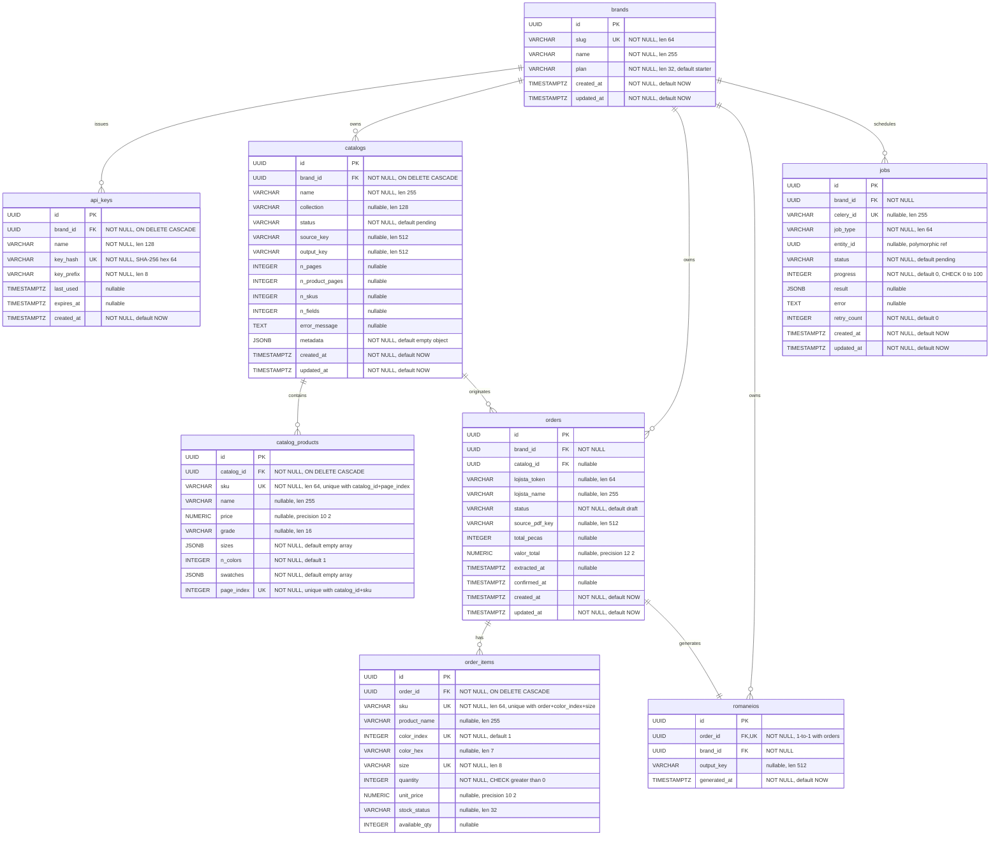

<!--
  Database ERD — CatalogFlow
  Gerado em: 2026-05-16
  Versão do spec: 0.1.0-draft (spec.md §7)

  Escopo: as 8 tabelas core do domínio definidas em spec.md §7.
  Tabelas adicionais introduzidas em sprints posteriores (web_users,
  magic_links, login_attempts, stock_checks, erp_submissions) NÃO
  estão representadas aqui por estarem fora do §7 do spec.

  Como renderizar:
  - GitHub: este arquivo renderiza nativamente.
  - mermaid.live: copie SOMENTE o conteúdo entre as cercas ```mermaid e ```
    (não cole o markdown completo, senão o parser não detecta o diagrama).
-->

# CatalogFlow — Database ERD



## Notas

- **`jobs.entity_id`** é uma referência polimórfica (não há FK física): aponta para `catalogs.id`, `orders.id` ou `romaneios.id` dependendo de `job_type` (`catalog.process`, `order.extract`, `romaneio.generate`).
- **`catalog_products`** tem `UNIQUE(catalog_id, sku, page_index)` — o mesmo SKU pode aparecer em páginas distintas (variações de cor).
- **`order_items`** tem `UNIQUE(order_id, sku, color_index, size)` — granularidade canônica de uma linha de pedido.
- **`romaneios`** é 1:1 com `orders` via `UNIQUE(order_id)`.
- Todos os relacionamentos com `brands` implementam o isolamento multi-tenant exigido pelo spec §12.
- Notação: `PK` = primary key, `FK` = foreign key, `UK` = unique key (inclui chaves únicas compostas — anotadas no comentário).
